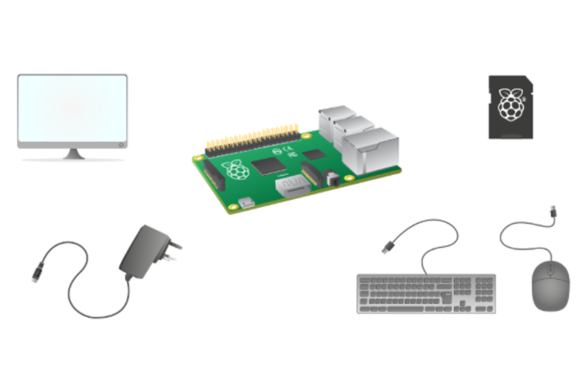

<!--Learning Lab "Digital Technologies"
Author: Holger Günzel 			Date: 2017 Oct 01
Changes by:
Holger Günzel 	- 2017 Oct 01 - Header updated
Lars Brehm		- 2018 Oct 16 - Updated to Raspbian "STRETCH" and header updated
Lars Brehm		- 2019 Sep 11 - general update to Raspberry Pi4 & Raspbian Buster and text adjustments
Holger Günzel	- 2019 Oct 18 - based on 1003 and 1011, adapted for HAT
Holger Günzel  - 2020 Oct 03 - logo and minor changes
Sonja Hofauer  - 2020 Sept 02 - combined 2001, 2003 for FHWS
-->

**Learning Lab: Internet of Things (IoT)**     
2024/25 winter semester | module |  

***

# Assignment 01: First Steps

## Objectives

- You will start the Raspberry Pi operating system (Bullseye) and do some initial steps
- We learn to use the system with the command line interface (CLI)

## Required Equipment

- Installed Raspberry Pi with OS
- Monitor with HDMI cable
- Keyboard
- Mouse

## Solutions Steps

So let's get started with  

  

1. **Unpack the Raspberry Pi resp. check out the Raspberry Pi in the case**  
  
   Avoid touching the circuit board directly, use the edges.  
   The **Raspberry Pi** comes without any peripheral input, output and storage devices. It is known as a **single board computer** and was sold for as little as EUR 35.

   

2. **Fix the Raspberry Pi in the case OR unfix & fix it again (OPTIONAL)**
  
   Use a screwdriver and a tweezer to screw on the raspberry into the case resp. un-screw and then screw it on again (depending on your situation)

3. **Examine the components of the Raspberry Pi**
  
   Look at detail at the **components of the Raspberry Pi**. Name them on the two enlarged images (see later this document) and describe their function.

4. **What is missing to start the Raspberry Pi?**  
  
   You need **input, output and storage devices**.  

   - **Input devices** let you send data to a computer. The two most common input devices are a *keyboard* and a *mouse*. You can plug in a USB keyboard and mouse into two of the four USB ports on the Raspberry Pi.  
   - **Output devices** let the computer send data to a user. Two of the most common output devices are a *monitor* and speakers. You can connect an HDMI monitor or television to the Raspberry Pi using the (micro) HDMI port. You can connect speakers or headphones to the Raspberry Pi using the 3.5mm headphone port.  
   - **Storage devices** are used to store data. The Raspberry Pi uses a type of Solid State storage device called a *microSD card* (instead of a hard drive). This will be used to store the Operating System, your software, and all the files you create.  
   - The last thing you’ll need to do is provide your Raspberry Pi with **power**. For this, we use a USB Type C (for Raspberry PI 4) power supply.

   What is missing on the following picture?
   <!--TeachingNote: Monitor cable-->

 

 (Source [1])  

5. **Loading the Operating System**  
  
   When your Raspberry Pi boots up, it will load its **Operating System**. This is the software that manages the computer, and is responsible for managing all the peripheral devices and resources for the software you might run.

     

6. **Operating System: Raspberry Pi OS**
  
   You’re probably used to Operating Systems such as Windows, MacOS, Android and iOS. Raspberry Pi OS is the Operating System we recommend for use with the Raspberry Pi. It is based on a popular version of the free and open source operating system, **Linux called Debian**.
   Linux operating systems are extremely popular. Computers running Linux are installed on most of the servers on the Internet.  

7. **Command Line Interface**
    Open the command line interface (or terminal window)  

 

 (Source [1])

   A new window will open with

   ```
   pi@raspberrypi: $
   ```

   The text above is the **command prompt. A CLI (=command line interface)** is actually a very quick and efficient way to use a computer. We will need it several times. If you want you can increase the window size with the mouse and also increase font size with ... goto `Edit` then `Preferences` and select in the right upper corner a large font size.

   Why may instead of `pi@raspberrypi` a different text appear on your CLI?

   <!--TeachingNote: Because you changed the name of your raspberry-->

8. **Configure the Raspberry Pi in CLI**  
  
   The next task is the configuration of the Pi via the terminal. To do that, you'll need to enter the following command:

   `sudo raspi-config`

   This will open up a menu on a blue background. Perform the following actions:

- Change your password for the user pi. Please ensure to remember it afterwards.
- Reboot

## Further Inputs

Connecting the peripherial devices to the Raspberry Pi:  

  

(Source [2])

## Hints

Raspberry Pi (Version 5) in large - top & bottom  

<br> <!-- Page brake -->
  

<br> <!-- Page brake -->
  

<br> <!-- Page brake -->

- All commands like cd, sudo, shutdown, reboot, etc. you will find via the search engine.

## Useful Resources for Own Searches

You can find the Raspberry Pi data sheet here:  
<https://www.raspberrypi.org/products/raspberry-pi-4-model-b/specifications/>

Source of this assignment: <https://www.raspberrypi.org/>

## Retrospective

Please answer the following questions

1. What is the meaning of `pi` in `pi@...` in the terminal/ CLI?
2. What are all the input and output ports on the raspberry pi?
3. What is `sudo`?
4. Why is it important to change the password?
5. Why should you `shutdown` the system?


and document each answer.

## Source(s)

- Lars Brehm, Holger Günzel: "Learning Lab: Home Automation with Internet of Things (HAT)" <https://www.ll4dt.org/>

- Main source for this assignment: <https://www.raspberrypi.org/>

- [1] <https://projects-static.raspberrypi.org/projects/raspberry-pi-using/2fc26278ee41e356e1115d976b5d7ff801c2e1eb/en/images/pi-command-prompt.png>


- Datasheet Raspberry Pi 5:  <https://datasheets.raspberrypi.com/rpi5/raspberry-pi-5-product-brief.pdf>

- [1] <https://ugc.futurelearn.com/uploads/images/bf/00/large_hero_bf0068c6-c13f-480f-b36b-70a295d0336b.png>

- [2] <https://s3-eu-west-1.amazonaws.com/raspberrypi-education/teaching-physical-computing/plug-in.gif>

- <https://www.futurelearn.com/courses/physical-computing-raspberry-pi-python/>

- <https://ugc.futurelearn.com/uploads/images/b4/94/b494a166-2890-49a9-88e6-1fb6e12294a2.svg>

