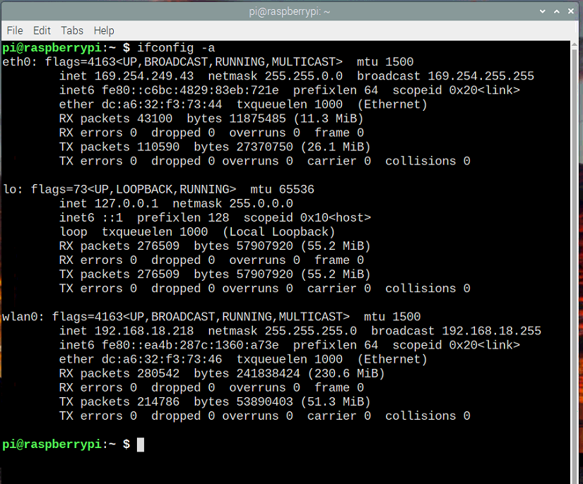

<!--- Learning Lab "Digital Technologies"
Author: Holger Günzel 			Date: 2017 Oct 01 
Changes by:
Holger Günzel 	- 2017 Oct 01 - Header updated 
Lars Brehm		- 2018 Oct 16 - Updated to Raspbian "STRETCH" and header updated
Sonja Hofauer  - 2020 Sept 02 - adapted 1005 for FHWS

SIMILAR CONTENT is used in the following Assignments - Please update in sync!
- 1402_T01_DBF_EN_Hardware_Kickoff_and_WiFi.md
- 1801_T01_JAI_EN_Hardware_Kickoff.md
- 1901_T01_DEVOPS_EN_Hardware_Kickoff_and_WiFi.md
See also
- 1001_T01_DTE_EN_Assemble_RaspPI_Start_OS.md
- 1005_T01_DTE_EN_Connect_with_the_internet_***.md
  
--->
**Learning Lab: Internet of Things (IoT)**     
2025/26 winter semester | module |  

***
# Assignment 02: Connect with the Internet - BayernWLAN

## Objectives
- In this assignment we start the wireless connection 

## Required Equipment
- Installed and running Raspberry Pi with OS
- Monitor with HDMI cable
- Keyboard
- Mouse

## Solutions Steps
**Step 1: Run the CLI/ Terminal**

**Step 2: Connect to WLAN**  
	First we activate a wireless connection via terminal.  
	To scan for WiFi networks, use the command `sudo iwlist wlan0 scan`.  This will list all available WiFi networks, along with other information. Locate the name of your Wi-Fi network in the list; this will be listed next to ESSID `ESSID: "@BayernWLAN"` is the name of the BayernWLAN WiFi network. `IE: IEEE 802.11i/WPA2 Version 1` (or similar) is for the authentication. You will need a password for this kind of networks. But, for the BayernWLAN you don't need a password.   
  Now you need to add your WiFi settings to the wpa-supplicant configuration file. Type the following in the command line to the configuration file: `sudo nano /etc/wpa_supplicant/wpa_supplicant.conf`. Go to the bottom of the file and add the following WiFi setting, adding your setting in the quotation marks.

	network={
		ssid="@BayernWLAN"
		key_mgmt=NONE
	}
	
Save the changes. At this point, the wpa-supplicant configuration file will normally notice within a few seconds when a change has occurred and it will try to connect to the WiFi network. If the WiFi does not connect then a reboot maybe required with `sudo reboot` . Once your WiFi has connected successfully you can verify it by typing `ifconfig wlan0`; if the `inet addr` field has an IP address in it then it has successfully connected.  


3. **Step 3: Click accept rules**  
	Try to use a web browser to connect with the Internet. It will search and search and search. What happened: you have to accept the rules of BayernWLAN.

	Follow the link 

	  ```
	  hotspot.vodafone.de/bayern
	  ```

   	and accept the regulations. Perhaps you have to accept "unsecure". 


**Step 4: Find your Network Address**

   To find your own network address you can just run the following command in the Terminal:

   ```bash
   ifconfig
   ```

   this will give you a picture like this [1]:  

     

   The lines where your IP stands is in the wlan0 section.
   inet: **192.168.18.218** is your IP address for *wifi connection*. This is a unique address in your network only one device can have this address.  
   ether **dc:a6:32:f3:73:46** is your MAC address. This is a unique address for your device. Only your device has this unique address and there is no other device in the world who has the same address. 

   These two numbers are closely related to each other. The IP address may change over time or every time you reconnect to the network you get an other ip address but your mac stays forever usually.


## Further Input


## Hints


## Useful Resources for Own Searches
Source of this assignment: https://www.raspberrypi.org/


## Retrospective

Please answer the following questions
1. What is the difference between MAC and IP?

2. Do you find an easier way to configure your WiFi access?

and document each answer.

## Source(s)

[1] https://linuxhint.com/get-mac-address-raspberry-pi/