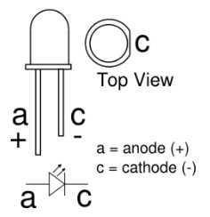
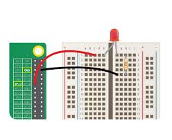

<!--- Learning Lab "Digital Technologies"
Author: Lars Brehm 			Date: 2017 Oct 01 
Changes by:
Lars Brehm 		- 2017 Oct 01 - Header updated 
Lars Brehm		- 2018 Oct 16 - Updated to Raspbian "STRETCH" and header updated
Lars Brehm		- 2019 Sep 11 - general update to Raspberry Pi4 & Raspbian Buster and text adjustments Holger Günzel	- 2019 Oct 19 - based on 1007; minimal adaptions 
Holger Günzel - 2020 Oct 03 - logo and minor changes-
Sonja Hofauer  - 2020 Sept 02 - adapted for FHWS

Similar to `1007_T01_DTE_EN_Blink_LED.md`
-->

**Learning Lab: Internet of Things (IoT)**    
2025/26 winter semester | module |  
***
# Assignment 03: Blink LED

## Objectives
- The objective of this assignment is to learn how to use the GPIO Pins as digital outputs
- You will learn how to setup the pin-mode (Input or Output)

## Required Equipment
- Installed and running Raspberry Pi with OS
- 1x LED,1x dropping resistor, bread board, cables  
- Power supply for the Pi 
- Monitor with HDMI cable
- Keyboard and Mouse connected via USB 


## Solutions Steps

Let us build a first example of home automation. We want to be able to switch on a lamp centrally in the house. For this we need a lamp, a computing unit and cables. With this we can switch the light on and off with one command.


1. **Step 1: Check installation of pinctrl**   

   **GPIO (General Purpose Input/Output) ports** are little pins sticking out of the circuit board of the Raspberry Pi (see picture in section `Further Input`). They allow you to plug various devices into your Pi. With a little programming, you can then control them or detect what they are doing. So they can be used to connect to the real physical world through **sensors** and **actors**.  
   **pinctrl** is a pre-installed software package, which activates the GPIOs and manages whether the Pin is an Output or an Input or anything else.
   Use the following command to check if the package has been installed.
   ```bash
   pinctrl help
   ```
   Try out the different commands listed in the help window to get familiar with the package.
  

   

2. **Step 2: Setup the Pin as Output**

   Set the GPIO Pin 17 as an output Pin in order to be able send (instead of receive) signals at this port. 

   ```bash
   sudo pinctrl 17 op
   ```

3. **Step 3: Set the Pin value to High/Low**

   The following line set the Pin to a High Value which will turn the Led on.

   To write a high value:

   ```bash
   sudo pinctrl 17 op dh
   ```

   To write a low value:

   ```bash
   sudo pinctrl 17 op dl
   ```

4. **Step 4: Connect the LED**

   To connect the LED you will have to watch out for the **right polarity**.  
   The LED has a polarity, which can be found out by watching on the length of the pins. 

   One pin is a bit longer than the other. **The longer of the LED is the positive side (anode)**. The positive side of the LED has to be connected to the GPIO pin that we just assigned the **value resp. positive side of power supply**.   
   The other side is the **cathode (shorter leg)** and has to connect to a **dropping resistor** which limits the current passing through the LED. Otherwise the **LED would be damaged or destroyed.**  
   After the resistor it has to go to one of the **GND Pins (ground)** on the Raspberry Pi.  

   

   Other ways to find out, which lead is the cathode: The cathode is marked on the rim of the LED body with a flat area shown in the diagram (see the top view of the sketch).  

- **Step 5: Switch LED on and off**  If you did everything right, the LED will turn on and off by entering the right command.
  

If not, just find the problem: 

  - Right GPIO pin?
  - LED direction?
  - cables on the breadboard?
  - cables at the GPIO-ports?

  

  <!--TeachingNote: 
  use `gpio -g write 17 1`
  GPIO17 is pin #11 in the overview below!
  -->

  Isn't it cool?

## Further Inputs

Background information: in the solderless breadboard the **holes are connected by horizontal lines with a break in the middle**. These holes contain small metal clips which both secure components to the breadboard and form electrical connections between the holes on one side without soldering:  

  

(Source [1])  


The **wiring** can be done the following way:  

  

(Source [2]) 


## Useful Resources for Own Searches
### Map of Pins 


(Source [3])


## Hints

Check out that

- you have connected the power cord and
- the monitoring via HMDI
- you are using a breadboard for solderless curcuits 

## Retrospective

Please answer the following questions

1. Are there different ways to control the GPIOs?
2. What is the benefit of using a breadboard?
3. The command `sudo pinctrl -p` lists the status of the    GPIO pins in the header. What do each column of the output represent?

and document each answer.

## References

- [1] <https://cdn.sparkfun.com/assets/e/7/7/e/c/5175c500ce395f5a49000004.jpg>
- [2] <https://encrypted-tbn3.gstatic.com/images?q=tbn:ANd9GcSo712oUWO1nBiUdBu1Yq4g0awCaaFz2VVuhsHXNRBqdK-l1T1MEA>
- [3] <https://az835927.vo.msecnd.net/sites/iot/Resources/images/PinMappings/RP2_Pinout.png>
- [4] <https://github.com/raspberrypi/utils/blob/master/pinctrl/README.md>

