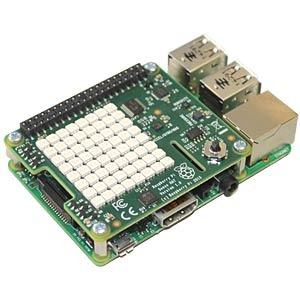
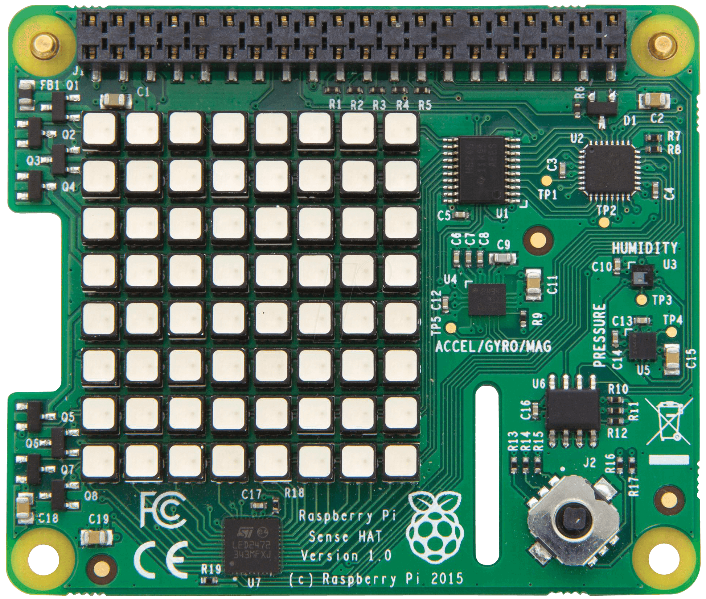

<!--- Learning Lab "Digital Technologies"
Author: Holger Günzel 			Date: 2019 Oct 18 base on 1008 and 1010 Changes by:
Holger Günzel - 2020 Oct 03 - logo and minor changes
Sonja Hofauer  - 2020 Sept 02 - adapted for FHWS
--->

**Learning Lab: Internet of Things (IoT)**    
2024/25 winter semester | module |  

***
# Assignment 04: Use of SenseHat

## Objectives
- Learn how to work with SenseHat using Python
- In this example we are going to read the temperature sensor

## Required Equipment
- Installed and running Raspberry Pi with OS
- Connection to the Internet
- Power supply for the Pi 
- Monitor with HDMI cable
- Keyboard and Mouse connected via USB 
- SenseHat 

## Solutions Steps
Now we are bringing sensors and actuators into our home automation world. Among other things, we want to include the environment temperature and have various visual output options. Of course, we could continue working with the GPIOs, but let a ready-made solution support us: the SenseHat.


- **Step 1: Attach Sense HAT to Raspberry Pi**  
Important: Make sure your Raspberry Pi is unplugged!

  First of all, shut down and unplug your Raspberry Pi. Then attach the SenseHAT (as shown below) and restart the Raspberry Pi. 
  Please make sure that the 0.5 cm thick adapter is present on the pins. This gives the Sensehat a distance of approx. 0.5 cm from the Raspberry Pi.  
  With a restart the Raspberry Pi all lights of the SenseHAT will flash (note: flash is quite bright!) und should go off during the booting of the OS.

  The Sense HAT is an add-on board for the Raspberry Pi. It adds the ability to sense all kinds of things, and to output information using a built-in LED matrix.  
  Unpack the Sense Hat and assemble the spacers (if required).   

  

  (Source: [1])

  

  (Source: [2])

- **Step 2: Install SenseHat package**  
  To install the SenseHat packages, which activates the I2C-Bus and providing the code libraries to use it. You have to put the following code lines into your Terminal. Be aware that the first statement is time consuming if the network is slow. 

  ```bash
  sudo apt-get update
  sudo apt-get install sense-hat 
  sudo pip3 install pillow
  sudo reboot  
  ```

  A reboot is necessary now to make the I2C changes work. These steps need only be done once per Raspberry Pi and must NOT be repeated every reboot. 

- **Step 3: Write a text on the Sense HAT**   
  For using the SenseHat, we need a programming language; the easiest way is to use Python. Click on Programming, and then click on Thonny Python IDE. A new window should open up on your desktop. In the shell you **can type Python code**, and it will be executed straight away. Have a go at typing the following lines into the shell. 

  Enter the following code, save it and run:

  ```python
  from sense_hat import SenseHat
  sense = SenseHat() 
  sense.show_message("Hello World!")
  ```

  In the Python IDE you have to import the libraries you just installed. With `show_message`, you can visualize your text.
  Note: If you are using SenseHat version 1.0 you might get a warning message.

- **Step 4: Read a Sensor**

  To read a sensor there are multiple ways. The most easiest way is to run a short Python script. Write the following commands in the editor (not the shell) and safe it under mysensor.py in the folder /home/pi/Documents/
  Then press on the button Run.

  ~~~python
  from sense_hat import SenseHat
  sense = SenseHat()
  sense.clear()

  temp = sense.get_temperature()
  print(temp)
  sense.show_message(str(temp))
  ~~~

  With `print`, you use the Terminal; `show_message` the SenseHat. 

  Why do you need the term `str`?

- **Step 5: Your individual Sensor reading**

  There are the following sensors on the SenseHat  
  * Gyroscope
  * Accelerometer
  * Magnetometer
  * Temperature
  * Barometric pressure
  * Humidity

  Now, it's your turn: show us the actual humidity and pressure on the sensehat display.

## Further Inputs
Here are links, which help you to solve the Problem in step 5

SenseHat Python API: <https://pythonhosted.org/sense-hat/api/>


## Hints
Check out that:  

  * you have connected the power cord and
  * the monitor via *HMDI*
  * You do not get an Error message when importing the Sense-Hat libraries into Python

## Useful Resources for Own Searches
[SenseHat Python API (at https://pythonhosted.org/sense-hat/api/)](https://pythonhosted.org/sense-hat/api/)

This is a useful link for more technical stuff: <https://www.raspberrypi.org/documentation/hardware/sense-hat/images/Sense-HAT-V1_0.pdf/>

This is a SenseHat Emulator, which let you try your Stuff even without a fully functional Raspberry Pi
<https://trinket.io/sense-hat>


## Retrospective
Please answer the following questions

1. How do the Sensors communicate with the Raspberry Pi?
2. Which other sensors do you know? Give 5 examples.
3. Optional: How could you run your python file mysensor.py from the CLI?
<!--- TEaching Note: cd /home/pi/Documents/
python3 mysensor.py
 -->

and document each answer.

## Source(s)
- [1] <https://cdn-reichelt.de/bilder/web/artikel_ws/A300/RPI_SENSE_HAT_5.jpg>
- [2] <https://cdn-reichelt.de/bilder/web/xxl_ws/A300/RPI_SENSE_HAT_3.png>
