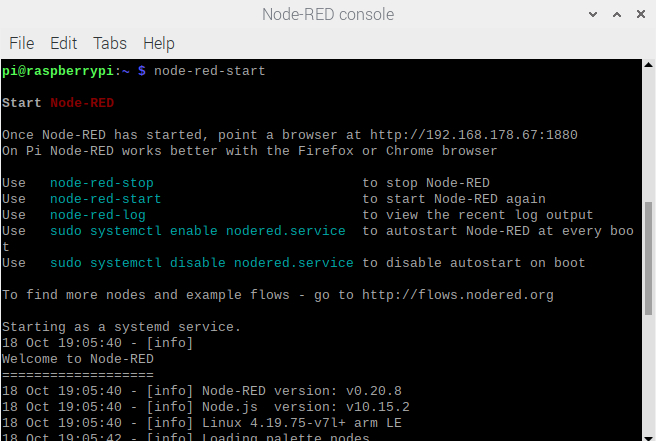
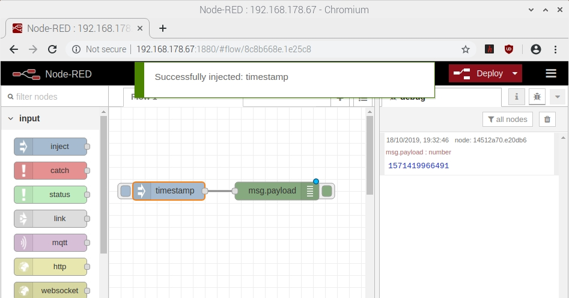
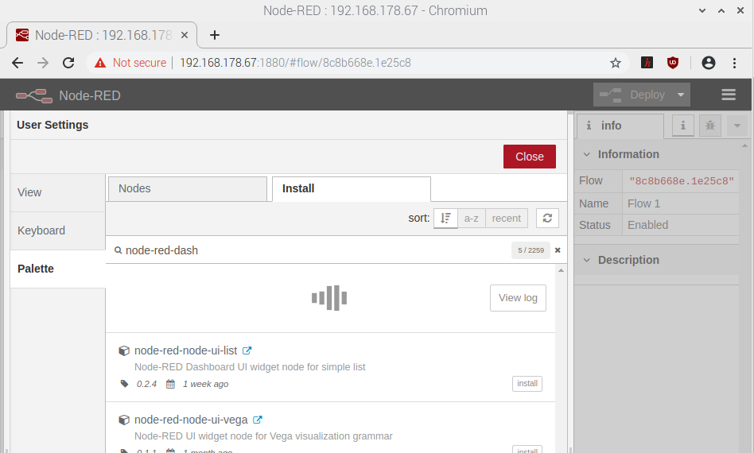

<!--- Learning Lab "Digital Technologies"
Author: Holger Günzel 			Date: 2019 Oct 18  Changes by: HG 2020 Oct 03
Sonja Hofauer  - 2020 Sept 02 - adapted for FHWS
--->

**Learning Lab: Internet of Things (IOT)**    
2025/26 winter semester | module |  

***
# Assignment 05: First Steps in Node-Red

## Objectives
- Creating understanding for Node-Red
- Compiling a first flow in Node-Red
- Creating a user interface with a dashboard

## Required Equipment
- Installed and running Raspberry Pi with OS
- Connection to the Internet
- Power supply for the Pi 
- Monitor with HDMI cable
- Keyboard and Mouse connected via USB 
- Attached SenseHat 

## Solutions Steps
In our previous examples we always had to send commands via the screen to control our lamps or displays or to activate the sensors. We lack a possibility to automate this. Therefore we use a software: Node-Red.

[Node-RED](https://nodered.org/) (www.nodered.org) is a visual tool for creating event-driven applications or "Flow-based programming for the Internet of Things", amongst many other uses. It is browser based and enables you to wire a whole host of different inputs and outputs together, with functions and other application logic.

**Step 1: Startup Node-Red**

  * Connect to your Raspberry Pi and check your Node-RED installation
    Start Node-RED with the command
    `node-red-start`

    

    ​and - don't do it now - stop it with `node-red-stop`

  * Open Node-RED in a browser. You can then access the Node-RED editor by pointing your browser
    at `http://<RASPBERRY_IP_ADDRESS>:1880` (type yourself or copy & paste from terminal window output).
  
    <!--(remember assignment 3 or copy & paste from terminal window output)
    -->
    *Hint:* <RASPBERRY_IP_ADDRESS> is just a placeholder for your Raspberry Pi's IP address which you found out in assignment 2.
  
    

    You see the workspace. The main workspace is where flows are developed by dragging nodes from the palette and wiring them together. On the left side you see the palette. The palette contains all of the nodes that are installed and available to use.

**Step 2: Our first flow**

1. Add an Inject node
   The `Inject node` allows you to inject messages into a flow, either by clicking the button on the node, or setting a time interval between injects.

   Just try and drag and drop the inject node.

2. Add a Debug node
  
    The `Debug node` (see output nodes) causes any message to be displayed in the Debug sidebar. By default, it just displays the payload of the message, but it is possible to display the entire message object.

3. Wire the two together
  
    Connect the `Inject` and `Debug nodes` together by dragging between the output port of one to the input port of the other.

4. Deploy
   
    At this point, the nodes only exist in the editor and must be deployed to the server. Click the `Deploy` button. 

5. Inject

    Switch to the debugging window on the right sidebar by clicking the icon `debug` (= bug symbol). Click on the left side of the `timestamp button` to trigger an event. You should see numbers appear in debugging window (at the right sidebar). By default, the Inject node uses the number of milliseconds since January 1st, 1970 as its payload (the default setting). Let’s do something more useful with that.

    <!--TeachingNote: 
    Check if debugging mode is active.
    Activate debugging for `msg.payload` by clicking the green box on right side of `msg.payload`. Now the message `Successfully activated: Debug` appears. (If you click again, the debugging mode will be deactivated.)  
    -->

    
  

6. Add a Function node
  
    The messages between the nodes are simple JavaScript objects. JavaScript is another programming language that is integrated into websites and interpreted by the web browser, i.e. executed on the computer of the specific person. 

    Therefore, the `function` node allows you to pass each message though a JavaScript function and modify it (https://nodered.org/docs/user-guide/writing-functions). 
    
    * Delete the existing wire (select it and hit delete on the keyboard).
    * Wire the `Function node` in between the Inject and Debug nodes.
    * Double-click on the `Function node` to bring up the edit dialog. Copy the following code into the function field (if you type it, you could skip the comments //)
    * Name the function toDate.
    
    We use the function node for manipulating the messages. The message is passed in as an object called `msg` (and must always return a msg object).  `payload` is one properties (attributes) of the object `msg`. Do you know the structure of an object in Python? 
  
    ```
    // Create a Date object from the payload
    var date = new Date(msg.payload);
    // Change the payload to be a formatted Date string
    msg.payload = date.toString();
    // Return the message so it can be sent on
    return msg;
    ```
  
    With msg.payload we get the value of the attribute payload of the object msg. We use the (predefined constructor) Date to get an new object. With date.toString() we use an inbuilt function (of Javascript) to convert the object's content into a string.

7. Deploy the model: 

    Click Done to close the edit dialog and then click the deploy button.
    Now when you click the Inject button, the messages in the sidebar will be more readable time stamps.

    

8. Test: Just click on the inject node and change the repeat to interval (every 5 sec). Done and deploy! What happened?

9. Deactivate Debugging: On the right side of the debug node, find a green switch for activating / deactivating debugging mode. 
   
    Deactivate debugging for `msg.payload` by clicking the green box on right side of `msg.payload`. Now the message `Successfully deactivated: Debug` appears. (If you click again, the debugging mode will be activated again.) You can use the `switch` to stop or start the output to that particular debug node. Turn off the output by clicking the switch. The data stops scrolling in the debug panel. We will need that later.

**Step 3: Dashboard** 

* Of course, it would be nice to display important information in a more readable way. Therefore, let's use the `node red dashboard`.
  Install dashboard nodes: Go to preferences (on the right side with three -), manage palette and install `node-red-dashboard` (just search for it) choose install and again install in the pop-up which appears. It last some minutes and will show a message of installed palettes. Press close afterwards.

  

* New nodes are added to your palette (see nodes)

* Now, let use it:

  * Add a text node (the one with the one dot/ connector on the left side): Use the text node and wire it after the `toDate` function node from your last flow. 
    <!--Teaching Note: A node can be connected to several others-->
  * Configure it (not configured nodes are marked with a red triangle). Give the node a name `TIME`, an label `TIME` and add it to an existing group. If no group exists, create the new group `GROUP1`. If required add a new tab `TAB1` for the group.
  * Deploy

* Browse your dashboard: Deploy your flow and browse to your dashboard. Point your browser to http://<RASPBERRY_IP_ADDRESS>:1880/ui in a new tab.

  

* Congratulations! Your Node-RED dashboard is running.
  Now you can design your user interface!


## Further Inputs

Javascript Introduction <https://www.w3schools.com/js/js_intro.asp>

Raspberry Pi with Node-RED Tutorial #2 – Make a user interface <https://www.youtube.com/watch?v=UKv4_jvPtr4>

## Hints

If your SenseHAT gets disconnected, try to change from python3 to python2 in the following folder: (open the explorer, type the following path)
home/pi/.node-red/node_modules/node-red-node-pi-sense-hat/sensehat 

## Useful Resources for Own Searches


## Retrospective
Please answer the following questions

1. What are the differences between Node-RED and other programming languages?
2. What is msg.payload for?
3. Why do I need to deploy? 

and document each answer.

## Source(s)
- <https://nodered.org/docs/getting-started/first-flow>

