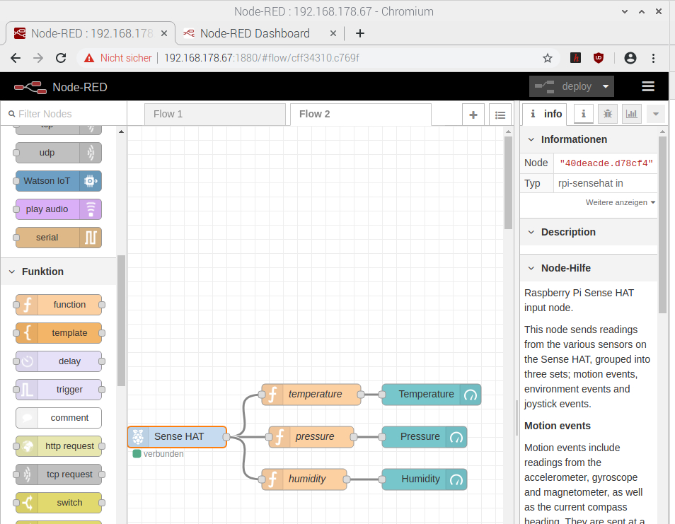

<!--- Learning Lab "Digital Technologies"
Author: Holger Günzel 			Date: 2019 Oct 18  Changes by: HG 2020 Oct 03 Some content
Sonja Hofauer  - 2020 Sept 02 - adapted for FHWS
--->

**Learning Lab: Internet of Things (IoT)**     
2025/26 winter semester | module |  

***
# Assignment 06: Visualize the environment data

## Objectives
- Visualize environment data with Node-Red and SenseHat

## Required Equipment
- Installed and running Raspberry Pi with OS
- Connection to the Internet
- Power supply for the Pi 
- Monitor with HDMI cable
- Keyboard and Mouse connected via USB 
- Attached SenseHat 

## Solutions Steps
Every home automation system lives from the central visualization of temperature, air pressure and humidity. To do this, we want to query the sensors automatically and create an output.


**Step 1: Install Sensehat in Node-Red**

* Go to the hamburger menu -> manage palette --> install tap and install the `node-red-node-pi-sense-hat` package.
<!-- If sense hat disconnects and error message in terminal:

Change from python3 to python2 in the following folder
home/pi/.node-red/node_modules/node-red-node-pi-sense-hat/sensehat 
works for me 
source: https://discourse.nodered.org/t/raspberry-sense-hat-problem/57918/2 
-->

**Step 2: Visualize the temperature in a dashboard**

This node sends readings from the various sensors on the Sense HAT, grouped into three sets; motion events, environment events and joystick events.

Environment events include readings from the temperature, humidity and pressure sensors. They are sent at a rate of approximately 1 per second. The `topic` is set to `environment` and the `payload` is an object with the following values:

- `temperature` : degrees Celsius
- `humidity` : percentage of relative humidity
- `pressure` : Millibars

Just start with the temperature:

* Drop the `Sense Hat Node` as a starting node (with the dot on the right)

* Connect with `function` and `gauge` (in dashboard)

* Double-Click on SenseHat. We can just select the environment events (joystick and motion could be "unselected")

* Change the name of the `function` in temperature and extend the function with 

  ```
  var o=msg.payload
  msg.payload = o.temperature;
  return msg;
  ```

  

* Change the `gauge node` in 

  * Group Temperature (i.e. define a new ui_group with the name Temperature)
  * Label in Temperature
  * Units in C
  * The range is between 0 and 100.

Deploy and look at the dashboard. If you see nothing, just look at you debug window or use an additional debug node. You can connect more than one successor node.

Of course, we still see the date. What are the options for no longer displaying them?

<!-- Entfernen der Verbindung führt nur zur Nicht-Aktualisierung der Zeit. Entfernen von Time und Deploy -->

**Step 3: Extend the flow with pressure and humidity**

Now, try to extend the actual visualization of temperature with pressure and humidity.




Deploy and look at the dashboard

**Step 4: SenseHat Output**

- Now, we extend the temperature flow with an specific response. In the case of a specific threshold (for example 37° C) has been exceeded, the SenseHat should visualize the degrees at the LED display. Hint: use the node `switch` under `function`  and the `SenseHat` node.

- Optional more interesting solution: below a threshold value, the display should flash green, above a threshold value red.

  <!-- use a function with msg.payload = "*,*,red"; return msg; 
  to apply it to several LED-lines use msg.payload = "*,0-3,red"
  for more info see https://flows.nodered.org/node/node-red-node-pi-sense-hat
  -->

## Further Inputs


## Hints
If the sensehat node shows the text 'disconnected' try to change from python3 to python2 for the sensehat node in NodeRed by performing the following steps:
1) In the terminal window (CLI) write the command `sudo nano /home/pi/.node-red/node_modules/node-red-node-pi-sense-hat/sensehat`
2) In line 2 you find `python_cmd='python3'` change this to `python_cmd='python2'`
3) Press Strg+O and Enter to safe the file
4) Press Strg+X to exit the file
   

## Useful Resources for Own Searches
<https://flows.nodered.org/node/node-red-node-pi-sense-hat>


## Retrospective
Please answer the following questions

1. What's the gauge node doing?
2. What do the functions do?

and document each answer.

## Source(s)
- Lars Brehm, Holger Günzel: "Learning Lab: Home Automation with Internet of Things (HAT)" https://www.ll4dt.org/
- Raspberry Pi with Node-RED Tutorial #2 – Make a user interface <https://www.youtube.com/watch?v=UKv4_jvPtr4>

  