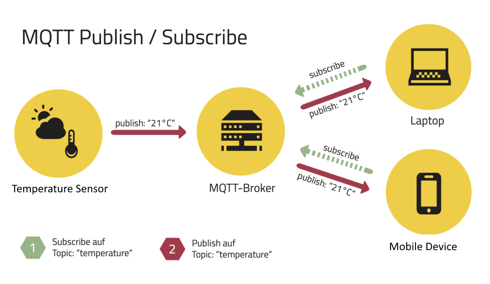
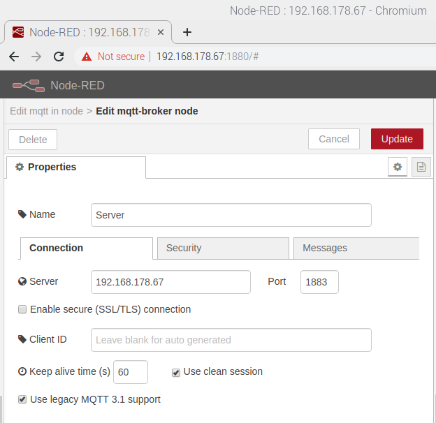
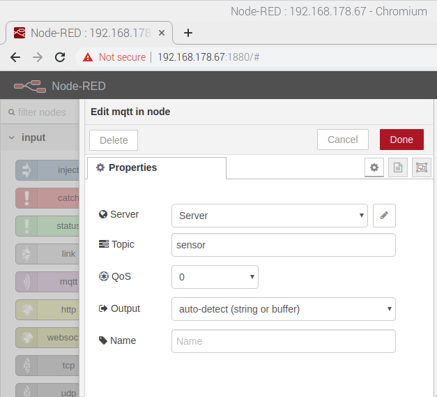
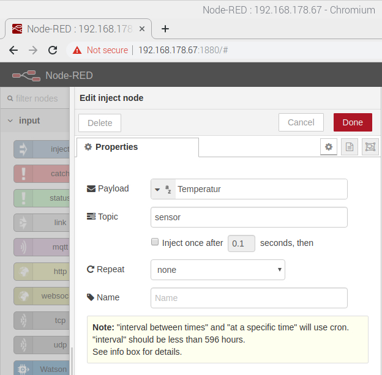
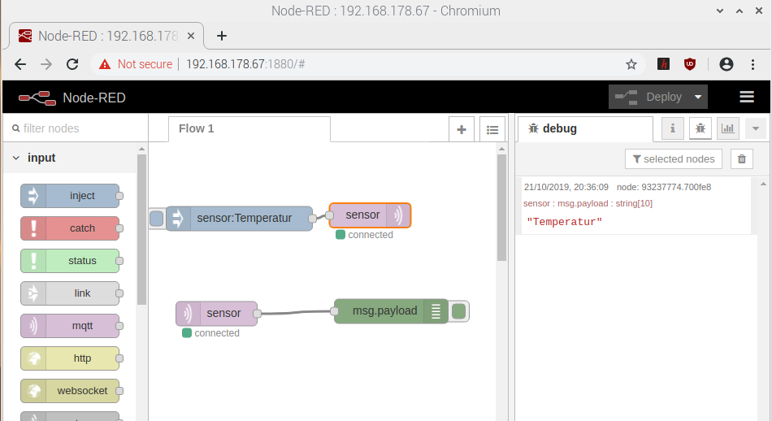

<!--- Learning Lab "Digital Technologies"
Author: Holger Günzel 			Date: 2019 Oct 18  Changes by: HG 2020 Oct 03 only logo
Sonja Hofauer  - 2020 Sept 02 - adapted for FHWS

--->

**Learning Lab: Internet of Things (IOT**    
2025/26 winter semester | module |  

***
# Assignment 07: Publish Data

## Objectives
- Understand the publish/ subscribe concept
- Use of a message broker with Node-Red  

## Required Equipment
- Installed and running Raspberry Pi with OS
- Connection to the Internet
- Power supply for the Pi 
- Monitor with HDMI cable
- Keyboard and Mouse connected via USB 
- SenseHat 

## Solutions Steps
Let's look at a new scenario. In your house there is a sensor that measures the outside temperature. This data should be sent to a number of screens when there is a change in temperature. The easiest way is to use a service publish and subscribe. The temperature data is published; anyone interested can subscribe to the service.

[MQTT](http://mqtt.org/) (http://mqtt.org/) - MQ Telemetry Transport - is a popular Machine-to-Machine (M2M) or Internet of Things (IoT) messaging protocol designed to be lightweight and reliable, suitable for use with microcontrollers and low bandwidth links.

It uses a central 'broker' to which clients connect, and can publish and/or subscribe to one or more 'topics', enabling messages to be exchanged between different systems. We will now build on a Mosquitto MQTT broker and Node-RED a new MQTT client with the Raspberry Pi and Sense HAT that can publish and subscribe to topics on our broker.




Publish/Subscribe-Architecture of MQTT (Source: HiveMQ.com)

**Step 1: Install a MQTT-Server**

To use the MQTT-Broker in Node-Red, you need a server on the Raspberry PI, which provides this function in the background. Install the open source mosquitto server that already exists on the Raspberry PI and start it.

```
sudo apt-get install mosquitto mosquitto-clients
```

To auto start the MQTT-Broker when the Raspberry Pi boots you need to run the following command (this means that the MQTT Broker automatically starts when the Raspberry Pi starts)

```
sudo systemctl enable mosquitto.service
```

From mosquitto version 2.x you must choose your authentication option explicitly. In our case we enable remote access without authentication (don't choose this for real-life applications). We need to edit a configuration file by using the following command:
```
sudo nano /etc/mosquitto/mosquitto.conf
```
Move to the end of the file using the arrow keys on the keyboard and add the two following lines:
```
listener 1883
allow_anonymous true
```
Press Strg-X to exit and save the file. Press Y and Enter.

You know have to restart the mosquitto server by typing the following command in the terminal window:
```
sudo systemctl restart mosquitto
```


**Step 2: Test of MQTT**

To test the mqtt-broker in advance, a MQTT flow is created in Node-Red. We need an inject and a MQTT output node. Just double click on the MQTT node it and add a new a name and your raspberry ID. Port will be 1883 (for an open port). 



For the topic, we will use sensor.

   

Now, we have to publish something. Let's publish the string Temperature.



To simulate the scenario on our raspberry we just need a subscribe flow. Use an input mqtt node and a debug node. The broker ID has to be the above mentioned ID with the same topic. Deploy and press on inject. You should see the word Temperature.





**Step 3: Inject real data**

The task is to exchange the current generic Inject with the environment data of the Sensorhat. 
How can only the temperature be published?

<!-- Exchange inject with Sensehat*; for selection of temperature use function and javascript-->

**Step 4: External publisher**

Let's try another scenario. You want to receive the battery status information of your electric bicycle. For this example your lecturer publishes the messages with the topic `ebike/battery` via an external MQTT broker. 

* Build a Subscribe flow and visualize the result. 

```
External broker:  broker.emqx.io
TCP Port:  1883
```

* When the battery is fully charged send the message "stop charging" together with your group number. 

<!-- Lecturer can send messages using google colab https://colab.research.google.com/drive/1P0iZpS-Zeb9bysiKooliPXU4ELpa9DmS#scrollTo=7Q1GuBRS2gaY -->

## Further Inputs

## Hints

To activate the Sensehat screen in colours use a string with `"\*,\*,red"`

## Useful Resources for Own Searches
<https://www.hivemq.com/docs/4.2/hivemq/introduction.html>

Very interesting: [Shodan](https://www.shodan.io/) (https://www.shodan.io/)


## Retrospective
Please answer the following questions

1. What is the meaning of Topic?
2. Do you think it's possible to access an MQTT-Broker of another team?
3. Briefly sketch how the data flows in step 2 including the components outside of node-red? 
4. What is the TCP Port 8883?

and document each answer.

## Source(s)
- Lars Brehm, Holger Günzel: "Learning Lab: Home Automation with Internet of Things (HAT)" https://www.ll4dt.org/
- <https://randomnerdtutorials.com/how-to-install-mosquitto-broker-on-raspberry-pi/>

- <https://www.hivemq.com/docs/4.2/hivemq/introduction.html>
  
- <https://mosquitto.org/>

  