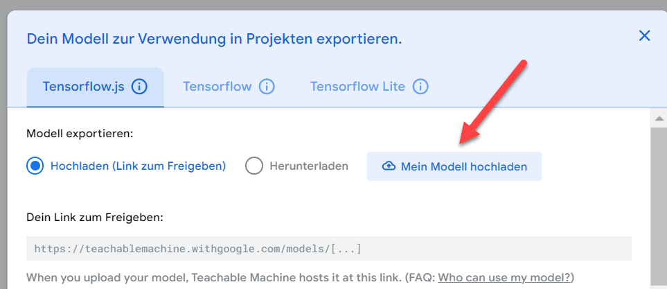

<!--- Learning Lab "Digital Technologies"
Author: Sonja Hofauer  - 2020 Sept 02 - adapted for FHWS
Sai Karthik Shankar - 2024 Nov 10 - adapted for raspberry pi 5 support
--->

**Learning Lab: Internet of Things (IOT)**    
2024/25 winter semester | module |  

<!-- TODO Update Bullseye camera https://www.raspberrypi.com/documentation/computers/camera_software.html-->
***
# Assignment 8: Build a Machine Learning Model to Classify Objects 

## Objectives
- Work with the Raspberry Pi Camera
- Train an Machine Learning Model to classify objects
- Use a Machine Learning Model in Node-RED 

## Required Equipment
- Installed and running Raspberry Pi with OS
- Connection to the Internet
- Power supply for the Pi 
- Monitor with HDMI cable
- Keyboard and Mouse connected via USB  
- Browser
- Camera
- Node-Red
  
## Solutions Steps
1. Connect the Raspberry Pi camera
   - Shut the Raspberry Pi down and unplug it.
   - If a sense hat is connected to the board, remove it to gain better access to it.
   - Connect the Raspberry Pi camera correctly, you find further details on this website  <https://projects.raspberrypi.org/en/projects/getting-started-with-picamera/2> 

   The information on the link is for an old Raspberry Pi OS version, you don't need to go to configuration and enable the camera interface in Bullseye version. It is enabled by default and recognises the camera automatically when it is plugged.


2. Take a picture using the terminal (Command Line Interface, CLI) and save it in the folder /home/pi/Documents 
   You find further details here: <https://projects.raspberrypi.org/en/projects/getting-started-with-picamera/3>
3. Optional: Record a video using the Command Line Interface and save it in the folder /home/pi/Documents 
   <https://projects.raspberrypi.org/en/projects/getting-started-with-picamera/3>
4. Next you need to build your machine learning model:
   - Start teachable machine to train your machine learning model for object classification (Note: you don't need an account to use it) <https://teachablemachine.withgoogle.com/train/image>  
   - Define your classes and provide input data. You need a lot of pictures for each class, therefore you can write a python code to take several pictures at once. Open the Thonny Python IDE under menu --> programming. Follow the instructions under <https://projects.raspberrypi.org/en/projects/getting-started-with-picamera/5>
   - Check the quality of your data, as this is crucial for the accuracy of your neural network.
   - Upload your pictures to teachable machine. Note: we are going to host the model on external servers. Have this in mind when you choose your input for the model.
   - Train your neural network for object classification with the help of teachable machine. Record pictures for testing (yes, you need additional pictures here) and test the results of your trained neural network in the browser.  
5. Export your model and save the link (you need it later in Node-Red)
     
6. Installing Additional nodes: In the previous assignments we installed additional nodes using the manage palette tab in node red. Alternatively, the Node package manager (npm) provides additional flexibility in installing nodes. 
- Use npm to install the following nodes.
   - The latest version of the package ```node-red-contrib-image-output```
   - Version 1.3.1 of the package```node-red-contrib-teachable-machine```
   - Install the package ```node-red-contrib-rpicamera``` from <https://gitlab.vlab.fm.thws.de/iotlab/material/raw/main/node-red-contrib-rpicamera.tgz>
- Hints-
   - npm install documentation - <https://docs.npmjs.com/cli/v10/commands/npm-install>
   - wget starter guide - <https://www.computerhope.com/unix/wget.htm>
7. Build your flows 
  - First, we are going to take a picture with the Raspberry Pi camera in Node-RED. We need an inject node, a "rpicamera" node and an image preview node. 
  Double click on the rpicamera node and specify the Image Resolution as 320x240 pixels. Deploy your nodes. When you click on the inject button Node-RED takes a picture and previews it on the image preview node.
   
  - Classify an object using the Raspberry Pi camera.
  We additionally need a  a "teachable machine" node. Wire the nodes as follows:
     
     
     You need to specify the following settings:
     - take photo node: File Mode Buffered Mode, Image Resolution 320x240 pixels
     - first image preview node: Property msg.payload
     - teachable machine node: 
         - Mode Online
         - Under link enter your previously uploaded machine learning model
         - Tick the box save image under msg.image
     - Second preview node: Property msg.image
   Don't forget to hit the deploy button. Then click on the inject node to take a picture and classify it. Hint: If you want to see the classfication result and its propability, click in the debug window on the little arrow next to the output object. Then you can display the class and its score.
8. Optional: Communicate the result on the Node-RED dashboard using the text node. Hint: The classification result is a JSON object (JavaScript Object Notation). You can access the class via msg.payload[0].class  


## Further Inputs

## Hints
- We are using the newest Raspberry Pi OS version called "Bookworm", the libraries/apps for accessing the camera are not the same as the previous ones.

## Useful Resources for Own Searches
- Documentation Node-RED node for teachable machine <https://flows.nodered.org/node/node-red-contrib-teachable-machine> 
- FAQ for teachable machine <https://teachablemachine.withgoogle.com/faq#Saving-&-Exporting>

## Retrospective
Please answer the following question(s) and document each answer.

1. Discuss the accuracy of your machine learning model. How could you make it more accurate?
2. Do you find another way of collecting input data? What are advantages/ disadvantages?
3. Why do you need to specify in the first image preview node the property msg.payload and in the second msg.image?
4. What have you learned?
